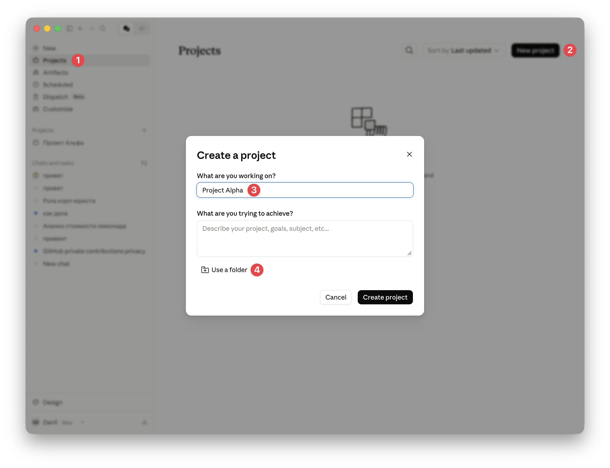
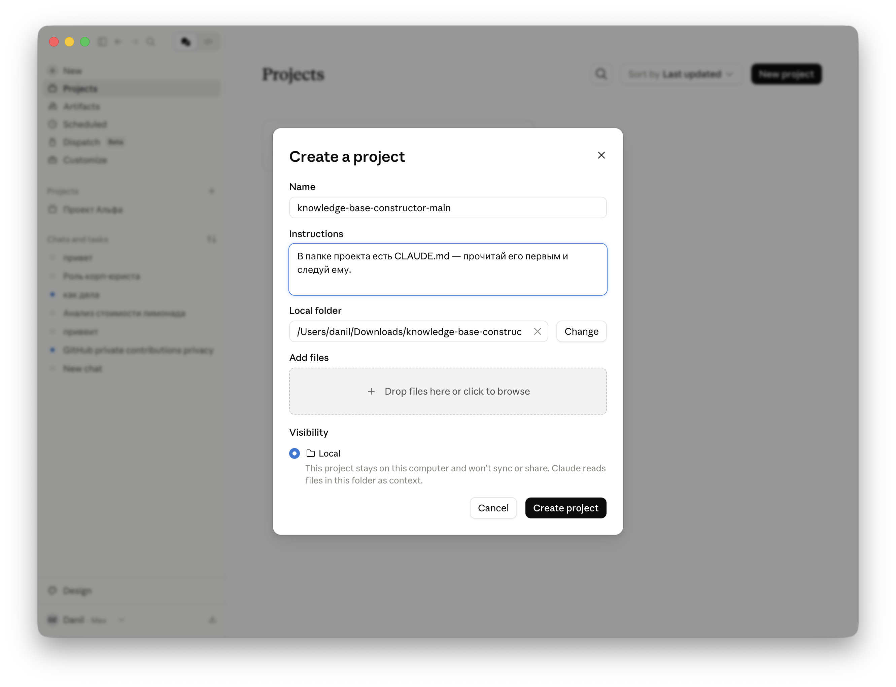

<!--
ИСТОЧНИК (.md) → собирается в Шпаргалка_Cowork.docx. Передаётся участникам ПОСЛЕ воркшопа.
Сюда влит бывший «Чек-лист первой недели» (раздел «План первой недели»).
Сверять с workshop-coffee.md / workshop-it-pm.md при изменении сценария. Сборка: python3 раздатки/build-docx.py раздатки/second-brain-materials/шпаргалка/Шпаргалка_Cowork.md раздатки/second-brain-materials/шпаргалка/Шпаргалка_Cowork.docx
-->
# Шпаргалка по Claude Cowork

Памятка после воркшопа: как ставить задачи, какие команды работают, чего не делать — и план на первую неделю.

---

## Как поставить проект на рельсы — чеклист

1. **Скачать конструктор.** Репозиторий <https://github.com/DanilZherebtsov/knowledge-base-constructor> → зелёная кнопка **Code → Download ZIP** → распаковать.
2. **Положить на диск.** Папку `knowledge-base-constructor-main` положите туда, где будете вести проект (например, папка документы); копию удобно переименовать под своё дело — `<название проекта>`.
3. **Создать проект в Cowork.** Claude Desktop → **Projects** → **New project** → **Укажите название проекта** → **Нажмите Use a folder** → выбрать эту папку.

4. На следующем этапе в графе **Instructions** вставьте следующий текст: `В папке проекта есть CLAUDE.md — прочитай его первым и следуй ему.`

5. **Пройти guide конструктора.** Первым сообщением расскажите, **кто вы и чем занимаетесь** (можно приложить должностную инструкцию). Ответьте на пару вопросов интервью — конструктор соберёт структуру под вас (`CLAUDE.md`, `raw/`, `wiki/`, `output/`, `input/`), «леса» уберёт.
6. **Занести документы (если есть).** Рабочие файлы кладите в папку **`input/`** проекта и попросите: «разбери эти документы и наведи порядок» — Cowork разложит сырьё в `raw/` и синтезирует знания в `wiki/`.
7. **Дальше — работа в чатах** (как на воркшопе): **1 чат = 1 задача**; после задачи — «запомни это» / «зафиксируй в `wiki/`»; отдельные роли (юрист, финансист…) — по мере накопления работы; раз в неделю — «сделай профилактику».

---

## Формула хорошей задачи

**КОНТЕКСТ → ЦЕЛЬ → ОГРАНИЧЕНИЯ → ФОРМАТ РЕЗУЛЬТАТА**

- **Плохо:** «Разбери папку с договорами».
- **Хорошо:** «В папке `Договоры/2025` лежат PDF договоров. Сделай Excel: контрагент, ИНН, сумма, срок. Если поле не нашёл — оставь пустым и пометь в столбце „проверить“. Сохрани как `реестр.xlsx`, исходники не трогай».

---

## Приёмы, которые всегда работают

- **«Перед началом задай мне 1–2 уточняющих вопроса»** — спасает от мусорного результата.
- **«Указывай источник / номер пункта для каждого факта»** — лечит галлюцинации: когда Claude обязан сослаться на место в документе, он не выдумывает.
- **«Дай образец нужного результата вот в таком формате»** — делает работу под ваш шаблон.
- **«Сначала посмотри базу знаний (`wiki/`), потом делай»** — Claude учитывает уже накопленное, не начинает с нуля.
- **«Запомни это: …»** — превращает решение/факт в запись базы знаний (`wiki/`) с датой и источником. Так база растёт по ходу работы.
- **«Здесь есть что-то важное, чтобы зафиксировать в `wiki/`? Предложи, что и куда»** — задавайте после большой задачи; база пополняется сама.
- **Большая партия файлов:** «обработай сначала первые 10, покажи результат» → потом «продолжай с теми же правилами». И в конце: «запомни этот шаблон обработки» — следующая партия запустится одним промптом.

---

## Полезные команды (триггеры)

- **С чего начать новый проект:** см. чеклист «Как поставить проект на рельсы» ниже. Коротко: скачай конструктор из https://github.com/DanilZherebtsov/knowledge-base-constructor, положи папку на диск, создай в ней проект в Claude Cowork и первым сообщением расскажи, кто ты и чем занимаешься. Конструктор проведёт по этапам и соберёт структуру; документы (если есть) клади в папку `input/`.
- **Завести сотрудника-роль:** «Создай роль юриста (финансиста, маркетолога) для нашего проекта». Вызвать в новом чате: «Работай в роли юриста».
- **Дообучить роль:** «Работай в роли юриста, у нас обновился корпоративный стандарт — обработай его и преврати в свои знания».
- **Профилактика раз в неделю:** «Сделай профилактику» — Claude проверит базу знаний и подтянет улучшения, не ломая ваши записи.
- **Задача по расписанию:** Scheduled Tasks → New → промпт + расписание (например, «каждый будний день в 09:00»).

---

## Режимы работы

- **Manual** — спрашивает разрешение на каждый шаг. **По умолчанию используем только этот.** В нём вы успеваете остановить и ошибку, и скрытую вредоносную инструкцию из чужого файла/сайта.
- **Automatic** — работает сам. Включаем только когда задача рутинная и уже проверена (например, отлаженная задача по расписанию). Удаление файлов Claude всё равно подтверждает всегда.

---

## Память: 5 уровней (+ STATE)

- **Global instructions** — личные предпочтения на все проекты (Settings → General → Instructions for Claude). Один раз настроил — работает везде.
- **Инструкции проекта (`CLAUDE.md`)** — правила этого проекта, грузятся в начало каждого чата. Собрал конструктор.
- **Контекст чата** — помнит до конца разговора; закрыли — забыл.
- **Claude memory** — контекст проекта между чатами; помогает, но со временем переписывается.
- **Папка `wiki/`** — синтезированные знания навсегда (решения, факты, контрагенты) с датами и источниками; доступны в любом чате.
- **`STATE.md`** — операционка: что в работе, что дальше, что ждёт решения (не память о мире).

Правило: **один бизнес-процесс = один проект.** Не пихайте всё в Instructions — туда только правила, факты в `wiki/`. Чат стал длинным и Claude «тупит» — попросите резюме в файл, начните новый чат, подайте резюме на вход.

---

## Когда начинать новый чат

Не ведите всё в одном чате. У Claude ограниченное «окно внимания» (контекст): чем длиннее чат, тем больше старого он держит в голове — начинает путаться и «тупить».

**Заводите новый чат, когда:**

- сменилась задача или тема — новый чат начинается с чистого стола;
- чат стал очень длинным и Claude замедлился или путается;
- нужна отдельная роль (юрист, финансист) — у неё свой чат.

**Почему так лучше:** общая память проекта (`wiki/` и Instructions проекта) видна во всех чатах, поэтому разделение НЕ теряет контекст — зато каждый чат остаётся коротким и точным. Если чат уже разросся: «сделай краткое резюме в файл», начните новый чат и подайте это резюме на вход.

---

## Безопасность — 4 правила

- **Одна папка — один проект**, не давать доступ к `Documents`/`Desktop` целиком.
- **Только с явного «да»:** платежи, отправка писем, удаление навсегда, передача файлов третьим лицам.
- **Чужие файлы и сайты** (от клиентов, контрагентов) — только в режиме **Manual** (защита от prompt injection).
- **Не класть** в Cowork без корпоративного плана: персональные данные клиентов, NDA-документы, медицинские/банковские данные третьих лиц (ФЗ-152).

---

## Когда что-то идёт не так

- **Claude застрял** → Stop → «Расскажи коротко, что сделал. Я скажу, как продолжить».
- **Выдал не то** → не начинай заново: «Это не подходит, потому что X. Переделай Y».
- **Похоже, выдумал** → «Перепроверь каждое число по исходникам, пометь, где не нашёл».
- **Не находит файл** → проверь, что папка подключена; при необходимости дай точный путь.
- **Ответ Claude не понятен** → напиши нормальным языком =)

---

## Как смотреть файлы проекта

Редактор кода не нужен — хватает штатных средств ОС:

- **Папка проекта** — открывайте в **Finder** (Mac) / **Проводнике** (Windows), держите рядом с Claude и смотрите, как растут `raw/`, `wiki/`, `output/`.
- **Просмотр `.md`** — на Mac выделите файл и нажмите **пробел** (Quick Look); на Windows включите область предпросмотра (View → Preview pane).
- **Результаты** — `.docx/.xlsx/.pptx` открываются в Word/Excel/PowerPoint; `.html` — двойным кликом в браузере.

---

## План первой недели

Цель недели — не выучить все возможности, а сделать Cowork привычным инструментом. Маленькие победы важнее больших экспериментов.

**Дни 1–2. Настройка**

- Claude Desktop установлен, подписка Pro активна, включается VPN.
- Создайте на компьютере отдельную папку для рабочих проектов.

**Дни 2–3. Первый проект**

- Поставьте проект на рельсы по чеклисту выше (скачать конструктор → положить на диск → создать проект в Cowork → пройти guide → занести документы в `input/`).
- Выберите ОДНУ реальную повторяющуюся задачу (разбор почты по клиенту, еженедельный отчёт, реестр документов).

**Дни 3–7. Пять простых задач**

Разминочные, по 10–15 минут каждая — не пытайтесь сразу решить главную проблему:

- разобрать одну папку документов в структурированный реестр;
- вытащить ключевые условия из одного длинного договора или ТЗ;
- сравнить 3–5 коммерческих предложений в единой таблице;
- переписать черновик письма/документа в финальную версию;
- собрать сводку отзывов/обратной связи по категориям.

**Привычки недели**

- Каждый день — только режим **Manual**.
- Раз в день — вкладка **Usage**, следить за расходом лимитов.
- Сработавший промпт — **сохранить** (ваша личная библиотека). Не сработавший — **записать проблему**.
- После 3-й задачи — попробовать завести специализированный чат-роль (юрист / финансист / ресёрчер).
- Раз в неделю — «сделай профилактику».

**Чего НЕ делать на первой неделе**

- НЕ переключаться на Automatic.
- НЕ давать доступ к личным папкам целиком (`Documents`, `Desktop`).
- НЕ загружать персональные данные клиентов, NDA, медицинские/финансовые данные третьих лиц.
- НЕ автоматизировать критичные процессы первые две недели — сначала наработать интуицию.

**К следующей встрече**

- Один пример, где Cowork сильно помог — что сделал, сколько времени сэкономил.
- Один пример, где Cowork не справился — что произошло, как чинили. **Это самое ценное.**
- Один промпт из своей библиотеки, которым гордитесь, — поделимся между собой.
